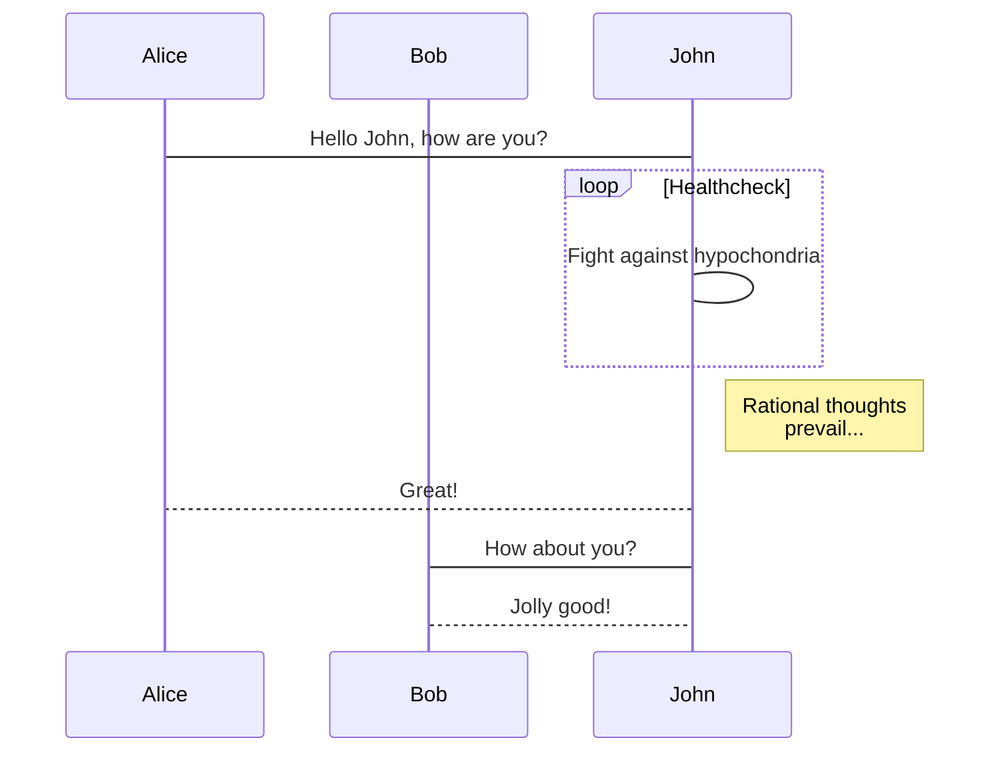

# Squelette du TP

## Utilisation

Pour utiliser ce tp vous devez :

1. le forker via le lien fork ci-dessus.
2. Votre repository doit être **privé**. Vous devez le partager avec votre encadrant de TP.
3. vous obtiendrez un nouveau lien : par exemple git@gitlab.istic.univ-rennes1.fr:monpseudo/....
4. Dans le **workspace d'eclipse** faites `git clone git@gitlab.istic.univ-rennes1.fr:monpseudo/...` avec l'url précédente.
5. Ouvrez le workspace dans eclipse. 
6. Utilisez Import> "Existing Maven Projects".
7. Selectionnez le projet et validez.

Vous devriez avoir une version du projet dans votre propre compte gitlab.

Vous pouvez le partager avec votre binome et l'encadrant de TP.


## Rapport 

Votre rapport doit être écrit ici en markdown.

Vous trouverez la syntaxe de markdown ici : https://docs.gitlab.com/ee/user/markdown.html

Placez vos images dans le répertoire images si nécessaire.


## Faire des diagrammes 

En particulier vous pouvez utiliser [mermaid](https://mermaidjs.github.io/) :




## Insérer du code 

Insérer du `code` :

```java
public interface ClientHandler {
    public void handle();
}
```

et des résultats :

```bash
[yo@capybara dkgr]$ nc google.fr 80
PWET /
HTTP/1.0 400 Bad Request
Content-Type: text/html; charset=UTF-8
Referrer-Policy: no-referrer
Content-Length: 1555
Date: Mon, 21 Jan 2019 12:18:02 GMT

<!DOCTYPE html>
<html lang=en>
  <meta charset=utf-8>
```
